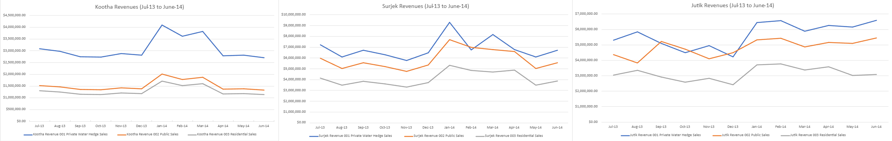
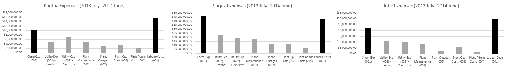
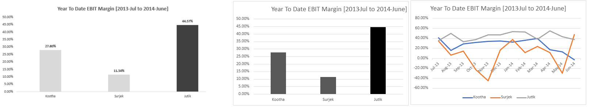

# 💧 Southern Water Corp Financial Analysis

## 📌 Project Overview

This project analyzes the financial and operational performance of Southern Water Corp to identify key drivers of revenue, costs, and profitability.

## 🎯 Business Objective

The objective of this analysis was to:

- Evaluate revenue performance across the company's plants
- Analyze operational expenses
- Identify major cost drivers
- Evaluate EBIT and profitability
- Provide data-driven recommendations to improve financial performance

## 🛠 Tools Used

- Microsoft Excel
- Financial Analysis
- Data Visualization
- Data Storytelling

## 📊 Analysis

The analysis focused on:

- Revenue
- Operational Expenses
- Chemical Costs
- Plant Performance
- EBIT
- EBIT Margin

## 🔍 Key Findings

The analysis showed that Southern Water Corp experienced increasing demand and revenue.

However, operating costs were also increasing.

The Surjek plant generated strong revenue but experienced disproportionately high chemical costs, negatively affecting overall profitability.

## 💡 Recommendation

The primary recommendation is to control chemical costs at the Surjek plant.

Improved cost management could help Southern Water Corp achieve approximately:

- **EBIT: $40M**
- **EBIT Margin: 20%**

## 📊 Revenue Analysis

**Insight:** Revenue increased across all three plants, with Surjek
generating the highest overall revenue. This indicates strong demand,
but revenue growth alone did not translate into proportional
profitability.

## 💰 Expenses Analysis

**Insight:** Chemical costs represent a major operating expense.
Surjek shows disproportionately high chemical expenses compared with
the other plants, making it the primary opportunity for cost reduction.

## 📈 EBIT Analysis

**Insight:** Despite strong revenue performance, Surjek has the weakest
EBIT margin. High operating costs, particularly chemical expenses,
are significantly reducing the plant's profitability.
## 📁 Project Files

The Excel analysis and supporting files are included in this repository.

## 🧠 Skills Demonstrated

- Data Analysis
- Financial Analysis
- Data Cleaning
- Microsoft Excel
- Data Visualization
- Business Problem Solving
- Data Storytelling
